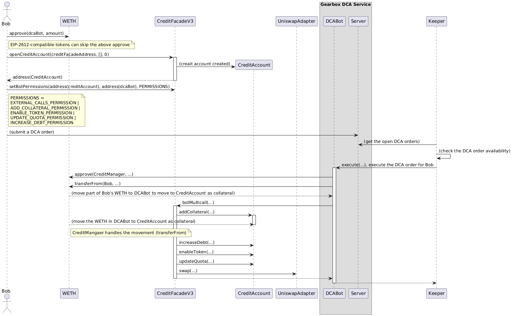

## Gearbox DCA Bot Example

## Flow



## Design Note

### How should we handle the `openCreditAccount`?

<details open>
<summary>Capital efficiency version</summary>

- User on-chain actions:
  1.  Approve `dcaBot` to spend 10 WETH (EIP-2612-compatible token can skip this step)
  2.  `creditFacade.openCreditAccount(user, [], 0)`
  3.  `creditFacade.setBotPermissions(dcaBot, PERMISSIONS)`
- Pros:
  1.  Capital efficiency: User can move their money easily. Funds will be moved when the order gets executed
- Cons: 1. Extra security risk: User needs to approve first to let dcaBot to spend their money
</details>

<details>
 <summary>(Skip) Capital inefficiency version</summary>

- User on-chain actions:
  1.  Approve `creditManager` to spend 10 WETH (EIP-2612-compatible token can skip this step)
  2.  `creditFacade.openCreditAccount(user, [addCollateral(WETH,10 ether)], 0)`
  3.  `creditFacade.setBotPermissions(dcaBot, EXTERNAL_CALLS_PERMISSION)`
- Pros:
  1.  Simple design: dcaBot only needs to care about the creditFacade's external calls
- Cons:
  1.  Capital inefficiency: collateral stores in the credit account first
  </details>

## Usage

### Build

```shell
$ forge build
```

### Test

```shell
$ forge test
```

### Format

```shell
$ forge fmt
```

### Gas Snapshots

```shell
$ forge snapshot
```

### Anvil

```shell
$ anvil
```

### Deploy

```shell
$ forge script script/Counter.s.sol:CounterScript --rpc-url <your_rpc_url> --private-key <your_private_key>
```

### Cast

```shell
$ cast <subcommand>
```

### Help

```shell
$ forge --help
$ anvil --help
$ cast --help
```
